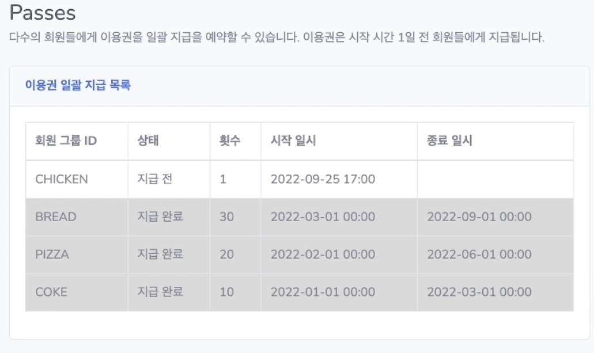

# 이용권

* 이용권 등록

  

  

  * 모든 패키지 중 지급할 패키지 선택

    

  * 모든 회원그룹 ID 중 지급할 회원그룹 ID 선택

    

  * 지급할 시작 일시 선택

    

  

  * 등록 버튼 누르면 추가 됨

    

* 사용자는 N개의 이용권을 가질 수 있다.

  

* 이용권은 횟수가 모두 소진되거나 이용기간이 지나면 만료된다.

  

  

* 이용권 만료 전 사용자에게 알림을 준다.(아직 미구현)

  

* 업체에서 원하는 시간을 설정하여 일괄로 사용자에게 이용권을 지급할 수 있다.

  * 일괄 지급 요청

    

  

  * 지급 완료

    

  * 이용권 추가

    

# 수업

* 예약된 수업 10분 전 출선 안내 알림을 준다.(아직 미구현)

  

* 수업 종료 후 이용권 횟수 차감한다.(아직 미구현)

# 통계 데이터

* 활성화 회원 수, 소득, 테스크, 오늘의 수업, 일별 출석 및 취소

  