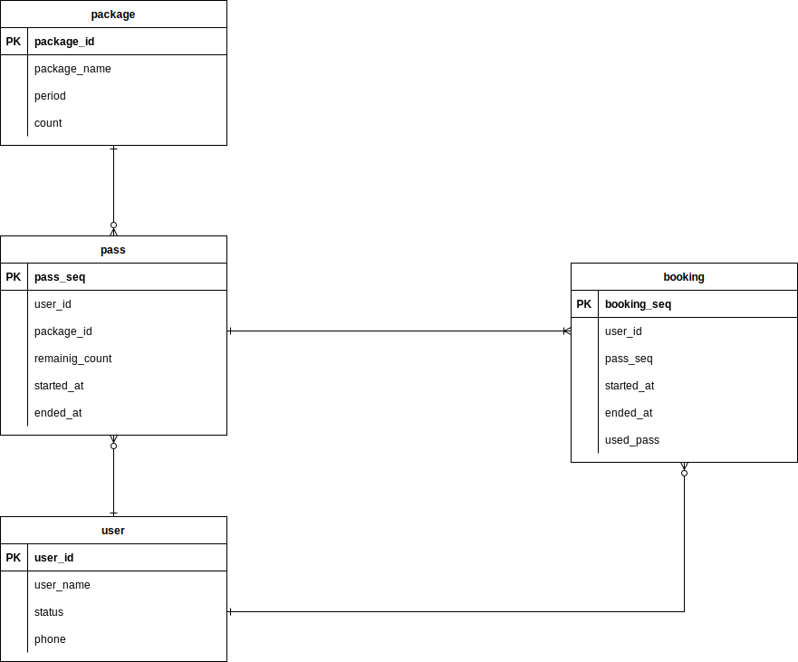

# 아키텍처

* DB
  * MySQL : RDBMS 필요, 프로젝트 규모가 작으므로 사용
* Batch
  * Spring Batch
* Web
  * Spring Boot

# ERD

# Batch 구조

# View + API

| 종류 | Endpoints         | Method | Input           | 기능                                                         |
| ---- | ----------------- | ------ | --------------- | ------------------------------------------------------------ |
| View | /passes/{user_id} | GET    | userId          | user 조회, pass list 조회                                    |
| View | /admin/bulk-pass  | GET    |                 | bulk pass 목록 조회, 등록을 위해 모든 package 조회와 모든 userGroupId 조회 |
| View | /admin/{to}       | GET    | to              | charData(라벨, 출석횟수, 취소 횟수)를 조회                   |
| API  | /admin/bulk-pass  | POST   | BulkPassRequest | bulk passs 생성 후, redirect /admin/bulk-pass                |

